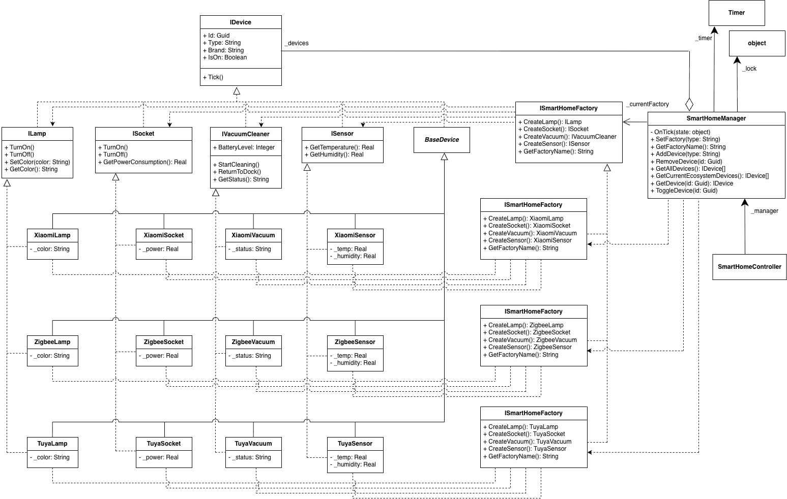

# Отчет по лабораторной работе №1

## 1. Описание проекта
Данный проект представляет собой симулятор системы управления умным домом (Smart Home Manager). Цель работы — продемонстрировать применение порождающего паттерна проектирования **«Абстрактная фабрика»**.

Приложение позволяет:
* Переключаться между экосистемами умного дома (Xiaomi, Zigbee, Tuya).
* Добавлять различные типы устройств (Лампа, Розетка, Робот-пылесос, Датчик).
* Управлять устройствами (включать/выключать, менять цвет ламп).
* Наблюдать за изменением состояния устройств в реальном времени (имитация работы через внутренний таймер).

## 2. Архитектура и паттерны проектирования

Основой архитектуры бэкенда является паттерн **Абстрактная Фабрика**. Он решает проблему создания семейств взаимосвязанных объектов (устройств конкретного бренда), не привязываясь к их конкретным классам.

### Ключевые компоненты:
* **Абстрактные продукты (Interfaces):** `IDevice`, `ILamp`, `ISocket`, `IVacuumCleaner`, `ISensor`. Определяют общий интерфейс для всех типов устройств.
* **Конкретные продукты:** Классы вроде `XiaomiLamp`, `ZigbeeVacuum`, `TuyaSensor` и т.д., реализующие специфичное поведение для каждого бренда.
* **Абстрактная фабрика:** Интерфейс `ISmartHomeFactory`, объявляющий методы создания каждого типа продукта (`CreateLamp()`, `CreateSocket()` и др.).
* **Конкретные фабрики:** `XiaomiFactory`, `ZigbeeFactory`, `TuyaFactory` реализуют методы создания устройств своей экосистемы.
* **Контекст (Клиент):** Класс `SmartHomeManager` использует интерфейс фабрики для генерации устройств. При смене экосистемы (например, с Xiaomi на Tuya) менеджер просто заменяет текущий инстанс фабрики.

> В коде также представлен антипаттерн `SmartHomeManagerNoPattern` для демонстрации того, как сильно усложняется код (появляются громоздкие конструкции `switch-case`) без использования паттерна.

### UML Диаграмма классов


## 3. Стек технологий
* **Backend:** C#, ASP.NET Core 8.0 Web API
* **Frontend:** React 19, TypeScript, Vite, Tailwind CSS, Lucide React
* **Инфраструктура:** Docker, Docker Compose, Nginx

---

## 4. Инструкция по запуску

Проект контейнеризирован, поэтому самый простой способ запуска — использовать Docker.

### Способ 1: Запуск через Docker (Рекомендуемый)

Убедитесь, что у вас установлены [Docker](https://www.docker.com/) и Docker Compose.

1. Откройть терминал в корневой папке проекта.
2. Выполнить:
   ```bash
   docker-compose up --build -d
   ```
3. После успешного запуска сервисов приложение будет доступно по адресам:
   * **Frontend (UI):** [http://localhost:3000](http://localhost:3000)
   * **Backend API Swagger:** [http://localhost:8080/swagger](http://localhost:8080/swagger)
4. Для остановки проекта выполните:
   ```bash
   docker-compose down
   ```