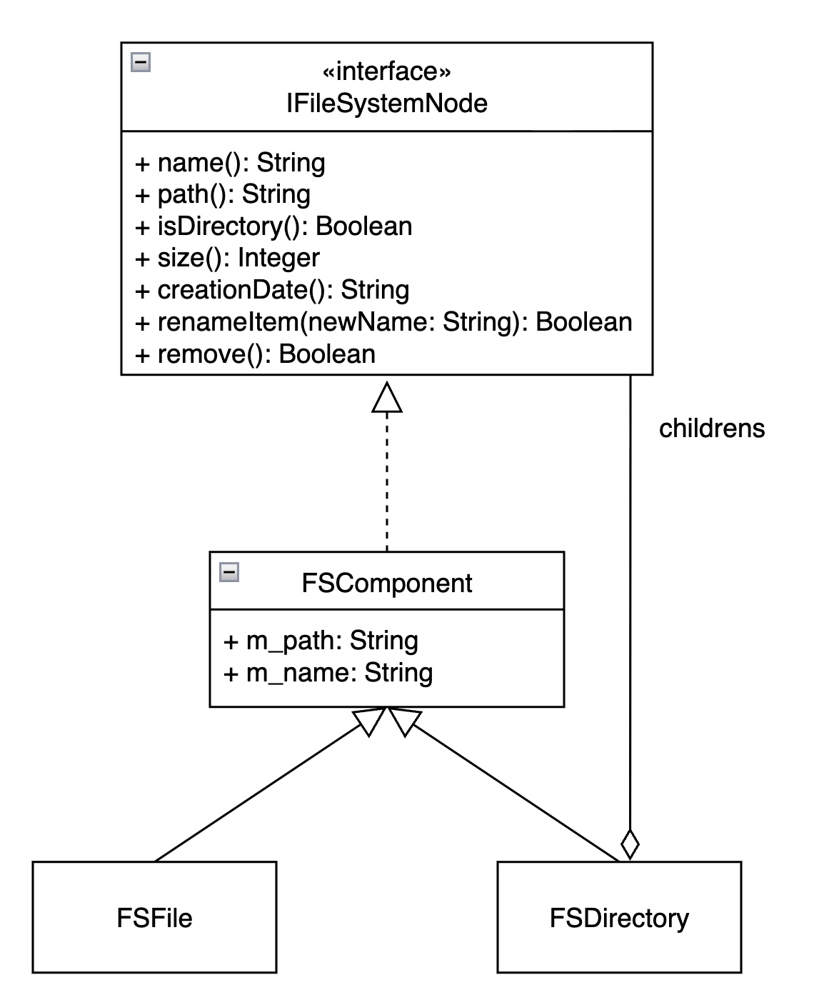

# Отчет по лабораторной работе №2

## 1. Описание проекта
Данный проект представляет собой нативный файловый менеджер для macOS («MyFinder»). Цель работы — продемонстрировать применение структурного паттерна проектирования **«Компоновщик» (Composite)**.

Приложение позволяет:
* Осуществлять навигацию по файловой системе (перемещение по директориям, возврат на уровень выше).
* Просматривать содержимое папок с отображением системных иконок, названий и размеров.
* Открывать файлы в приложениях по умолчанию.
* Выполнять базовые файловые операции: просмотр информации (Get Info), переименование и удаление файлов/папок.
* Автоматически рекурсивно подсчитывать размер директорий.

## 2. Архитектура и паттерны проектирования

Основой архитектуры приложения является паттерн **Компоновщик (Composite)**. Файловая система — классический пример древовидной структуры, где папки могут содержать файлы или другие папки. Паттерн позволяет единообразно обращаться как к отдельным файлам, так и к директориям, не задумываясь об их различиях.

### Ключевые компоненты:
* **Component (Интерфейс):** `IFileSystemNode`. Определяет общий интерфейс для всех узлов файловой системы (`name()`, `size()`, `isDirectory()`, `children()`, `remove()` и др.).
* **Базовый класс:** `FSComponent`. Реализует общую логику для всех элементов (хранение пути, имени, базовые функции переименования и удаления).
* **Leaf (Лист):** Класс `FSFile`. Представляет неделимый элемент — файл. Его метод `isDirectory()` возвращает `false`, а `children()` возвращает пустой список. Метод `size()` возвращает размер конкретного файла.
* **Composite (Контейнер):** Класс `FSDirectory`. Представляет узел, содержащий другие узлы. Метод `children()` сканирует папку и генерирует новые объекты `FSFile` или `FSDirectory`. Метод `size()` рекурсивно вычисляет суммарный размер всех вложенных элементов.
* **Клиент:** Класс `MainAppController` (UI), который работает исключительно с указателями на абстрактный интерфейс `std::shared_ptr<IFileSystemNode>`, отрисовывая таблицу и вызывая методы без привязки к конкретным классам.

### UML Диаграмма классов


---

## 3. Запуск
   ```bash
   clang++ -std=c++17 -framework Cocoa -framework QuartzCore -fobjc-arc main.mm FileSystemComposite.mm FileSystemPlain.mm -o MyFinder
   ./MyFinder
   ```