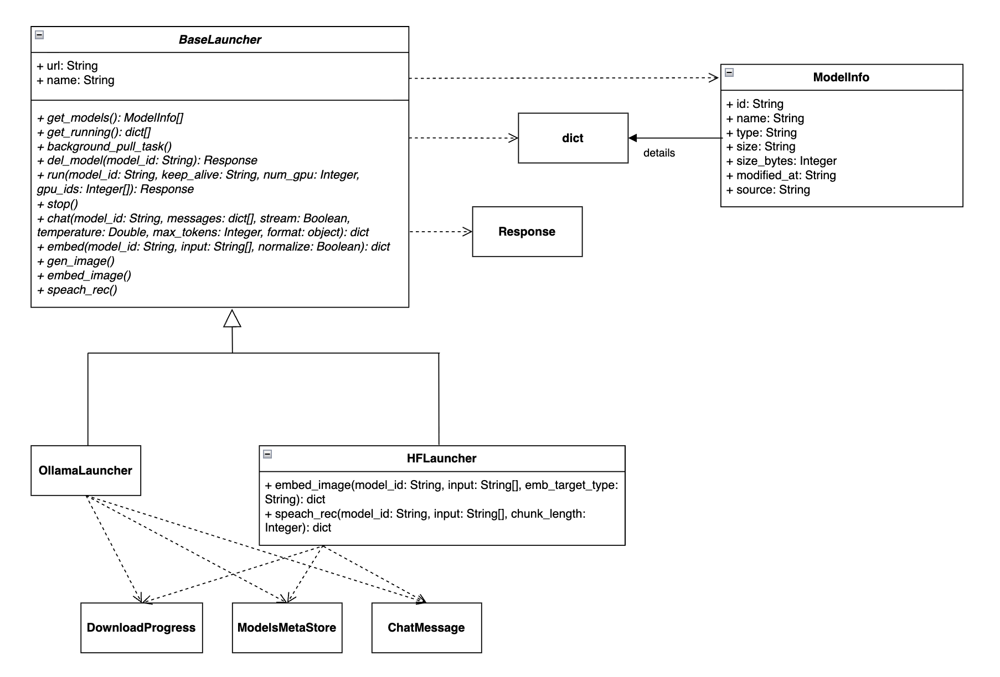

# Отчет по лабораторной работе №3

## 1. Суть проекта
**Locus API** — это унифицированный шлюз (API-прокси) на базе FastAPI для оркестрации и использования локальных ML-моделей. Проект объединяет под одним интерфейсом несколько бэкендов (на данный момент **Ollama** и **HuggingFace**-сервис) и предоставляет как собственный API, так и эндпоинты, совместимые со стандартом **OpenAI**.

## 2. Технологический стек
*   **Фреймворк:** Python 3.11+, FastAPI, Uvicorn, Pydantic 2.x.
*   **Сетевое взаимодействие:** `httpx` (асинхронные HTTP-запросы к бэкендам).
*   **Мониторинг ресурсов:** `psutil` (CPU, RAM, Диски), `pynvml` (NVIDIA GPU).
*   **Инфраструктура:** Docker, Poetry (управление зависимостями).

## 3. Архитектура и основные модули
Код хорошо структурирован по паттерну MVC/сервисной архитектуры:

*   **`core/launchers/` (Провайдеры моделей):** 
    *   Реализует паттерн «Адаптер». Есть базовый абстрактный класс `BaseLauncher`.
    *   `OllamaLauncher` и `HFLauncher` отвечают за трансляцию универсальных запросов системы в специфичные API Ollama и локального HuggingFace-инстанса.
*   **`core/routes/` (Эндпоинты API):**
    *   `/api/model.py` — нативные методы (загрузка, запуск, чат, эмбеддинги, распознавание речи, метаданные).
    *   `/v1/open_ai_api.py` — **OpenAI-совместимый API** (`/v1/chat/completions`, `/v1/embeddings`, `/v1/models`). Позволяет использовать Locus как drop-in замену OpenAI в сторонних приложениях.
*   **`core/services/` (Бизнес-логика и состояние):**
    *   `hardware.py` — сбор подробной статистики о железе, включая утилизацию, температуры и память видеокарт NVIDIA.
    *   `download.py` — фоновое отслеживание прогресса скачивания моделей.
    *   `meta.py` — персистентное хранилище (JSON) метаданных моделей (тип, теги).
    *   `store.py` — In-memory хранилище состояния запущенных в данный момент моделей.

## 4. Ключевые возможности
1.  **Универсальный инференс:** Поддержка text2text (чат), текстовых эмбеддингов, эмбеддингов изображений и распознавания речи (speach-to-text).
2.  **Управление ресурсами:** Возможность явно указывать, куда грузить модель (CPU или конкретные ID видеокарт), и задавать время жизни (TTL / keep_alive).
3.  **Асинхронность:** Полностью асинхронный код. Загрузка тяжелых моделей (`pull`) вынесена в фоновые задачи (`BackgroundTasks`) с возможностью контроля прогресса.
4.  **Мультимодальность:** Встроена базовая обработка сообщений с изображениями (преобразование Base64 для передачи в LLM).
5.  **Единая точка входа:** Клиенту не нужно знать, где физически хостится модель (в Ollama или HF) — система сама маршрутизирует запрос на нужный лаунчер на основе метаданных.

## 5. Паттерн
*   **Интерфейс стратегии:** Абстрактный базовый класс `BaseLauncher` (в `base.py`) задаёт единый контракт (набор методов: `run`, `chat`, `embed`, `stop` и др.), который должны поддерживать все системы запуска моделей.
*   **Конкретные стратегии:** Классы `OllamaLauncher` и `HFLauncher` реализуют этот интерфейс, инкапсулируя в себе совершенно разные алгоритмы и логику формирования HTTP-запросов к специфичным API бэкендов (Ollama и HuggingFace соответственно).
*   **Контекст / Механизм выбора:** Роутеры API (например, методы в `model.py`) не знают, с каким именно бэкендом они общаются. При поступлении запроса они берут источник модели из метаданных (`model_source = models_meta.get(req.model).get("source")`) и передают его в функцию-фабрику `get_launcher(model_source)`. Эта функция динамически подменяет реализацию (возвращает нужную стратегию) прямо во время выполнения (Runtime).
