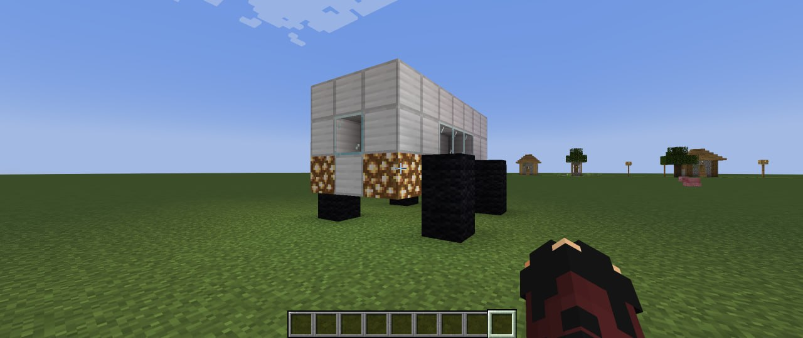
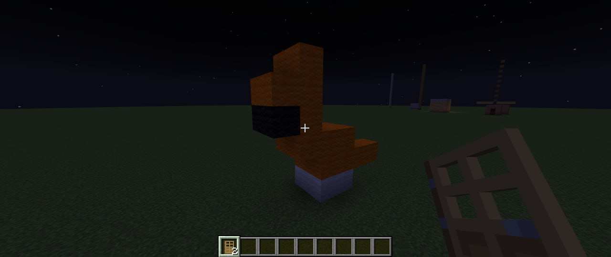
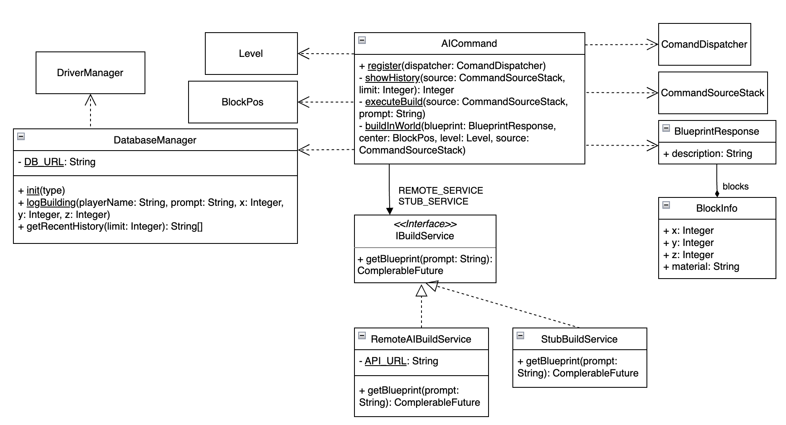

# Отчет по лабораторной работе №4

## 1. Суть проекта
Minecraft-мод на платформе Forge, который позволяет генерировать игровые постройки с помощью внешнего AI-сервиса через текстовые запросы.

## 2. Реализованный функционал
*   **Команда `/aibuild <prompt>`**: Отправляет запрос на локальный API-сервер (порт 8112), получает чертеж в формате JSON и возводит постройку в мире в реальном времени.
*   **Команда `/aihistory [limit]`**: Выводит список последних запросов из базы данных, включая имя игрока, текст запроса и временную метку.
*   **Логирование**: Обработка текстовых описаний (`description`) от нейросети с выводом в консоль сервера через SLF4J.
*   **База данных**: Интеграция SQLite для локального хранения истории сгенерированных построек.

## 3. Архитектура и паттерны
В проекте реализован паттерн **«Фиктивная служба (Service Stub)** для обеспечения отказоустойчивости системы.

### Схема реализации:
1.  **Интерфейс `IBuildService`**: Определяет контракт для получения чертежей.
2.  **Класс `RemoteAIBuildService`**: Реальная логика. Выполняет асинхронные HTTP-запросы к нейросети.
3.  **Класс `StubBuildService` (Фиктивный метод)**: Заглушка, используемая при недоступности основного сервера. Генерирует стандартный объект (куб из грязи 3x3x3).

## 4. Технологический стек
*   **Java 21 / Forge API** (версия Minecraft 1.21).
*   **Java HttpClient**: Для асинхронного взаимодействия с API.
*   **SQLite + JDBC**: Для хранения истории.
*   **Gson**: Для парсинга сложных структур данных (чертежей).

## 5. Демонстрация

## 6. Диаграмма классов
